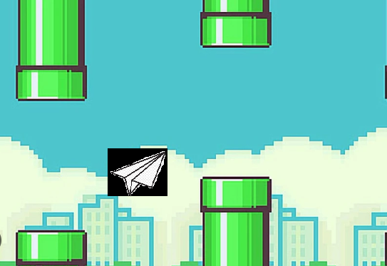

# Flappy Bird
### Duncan Luis Munguia Bejarano 222310239
### Emmanuel Cabrera Garcia 22310177

## History of the Game:
### Flappy bird game was developed by Dong Nguyen in May 2013, at the beginning it was not uploaded thinking it would be a success, however in the first year it showed a great growth for IOS users.

## How to play? :)
### The mechanics of this game is quite easy, the game is to dodge the pipes and get the highest score possible. By pressing the "Space" key you raise Charizard.
### To make this game run, you have to put in the "Terminal" this code: "make run"

  

## Diagram:
### This diagram shows the flow we follow to perform the game, separating each class and seeing what is acting in the game.

